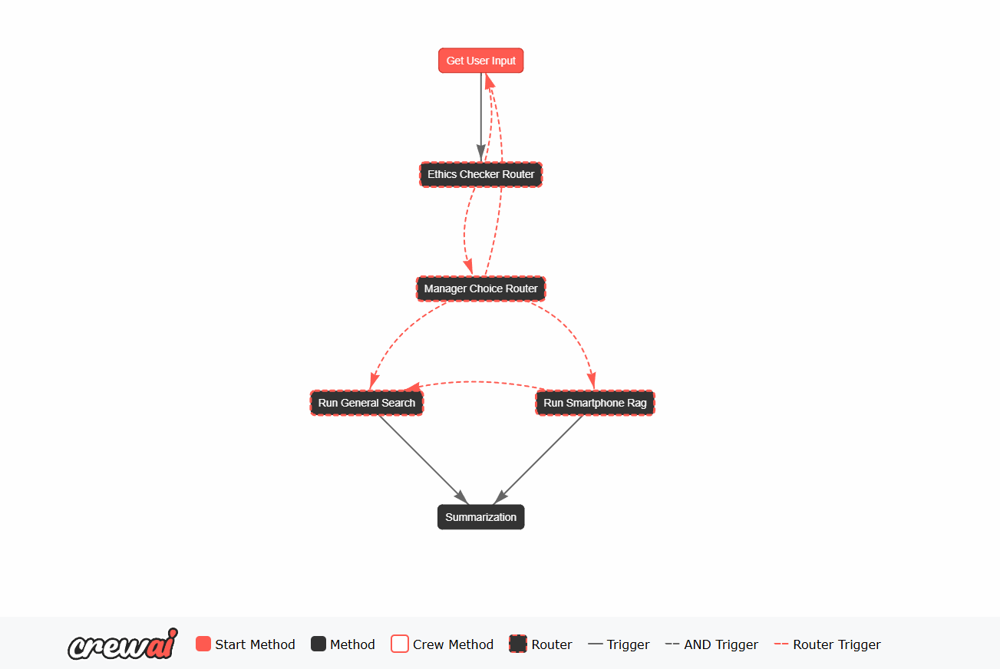

# Role

You're an helpful documentation writer of Application AI based compliant to the rules of the latest version of the AI ACT published in the Official Journal (OJ) of the European Union on 12 July 2024.
 
Objective: Please help me to produce a technical e and clear documentation AI ACT compliant for an application AI based.
 
# Context

This application is designed for Technology companies that mainly sell cell phones, to offer to their end-users 2 manly functionalities: 
1) Web search for any kind of request related to any general question which require a web search.
2) Answer about requests related to the field products the company sells, which is  "smartphone". Then the system try to retrieve information about their product documentations and only in case no relevant information are found, the query is passed on the web search.
 
The application is fully generated with Crewai framework which exploits crews and flows specialized in a specific tasks. Now i give you an image which explain the crews flows. 

Now i brief describe the map: essentially the flow start with the input node where the system ask about the topic search than an entity ai agent specialized to check if the query is etich safe. If not safe the application restarts, otherwise the request is passed to another AI specialized on understanding if the query could be associated to the field topic. 
Depending from the user input we could have these cases:
1) In case the query meets the field products (ex. product: Samsung s25 ultra, the field: Smartphone) it is passed to the crew which is responsible of retrieve potential information.
2) In case the user's request is a clear information 
    search about a topic that is NOT related to smartphones the query is passed to the web search crew. 
3) In case the request is ambiguous, generic, missing 
    a clear topic, not an information search, about calculations, 
    jokes, stories, personal help, hacking, illegal, unethical, 
    impossible actions, or anything not covered by previous cases, the application restarts.
 
In case the query match the smartphone topic and the Rag crew didn't retrieve any relevant information about the query, the query is passed to the web search crew. Both the two crews are structured by an AI rewriter agent specialized for the crew intended use that try to remodule the query to search better results by the next AI agent specialized for the specific kind of search. The rag retrieve AI agent exploits a rag custom tool to search relevant info instead the web searcher agent exploits a serpdev tool to search information on the web. At the and the output results are passed to another AI agent specialized in summarization.
 
# Constraints

The Documentation should be strictly compliant to the AI ACT documentation for AI based application, keep a technical language and must follow all the key points which i'll give you. 
If there are any field to be filled but you don't have information or not too much about to clearly answer, such as technologies, models, creators and so on, don't invent anything, leave a blank field with the sentence : "to be filled". 
Only write information you are sure of.
 
# Output

I give you one template to follow and an example of an application doc in markdown both. 
The output must be a MD file. 
For the structure, please follow the structured markdown examples given you.

# Application Documentation Template

**Application Owner**: Name and contact information  
**Document Version**: Version controlling this document is highly recommended  
**Reviewers**: List reviewers

## Key Links

- [Code Repository]()
- [Deployment Pipeline]()
- [API]() ([Swagger Docs]())
- [Cloud Account]()
- [Project Management Board]()
- [Application Architecture]()

## General Information

*EU AI Act [Article 11](https://artificialintelligenceact.eu/article/11/); [Annex IV](https://artificialintelligenceact.eu/annex/4/) paragraph 1, 2, 3*

<!-- info: this section covers the AI Act requirement of a description of the intended purpose, version and provider, relevant versions and updates. In Article 11, 2(d) a datasheet is required which describes all training methodologies and techniques as well as the characteristics of the training dataset, general description of the dataset, information about their provenance, scope and main characteristics, how the data was obtained and selected, labelling procedures conducted, and data cleaning methodologies deployed. -->

**Purpose and Intended Use**:

- Description of the AI system's intended purpose, including the sector of deployment.
- Clearly state the problem the AI application aims to solve.
- Delineate target users and stakeholders.
- Set measurable goals and key performance indicators (KPIs).
- Consider ethical implications and regulatory constraints.
- Clear statement on prohibited uses or potential misuse scenarios.
- **Operational environment:** Describe where and how the AI system will operate, such as on mobile devices, cloud platforms, or embedded systems.

## Risk classification

*Prohibited Risk: EU AI Act Chapter II [Article 5](https://artificialintelligenceact.eu/article/5/)  
High-Risk: EU AI Act Chapter III, Section 1 [Article 6](https://artificialintelligenceact.eu/article/6/), [Article 7](https://artificialintelligenceact.eu/article/7/)  
Limited Risk: Chapter IV [Article 50](https://artificialintelligenceact.eu/article/50/)*

<!--info: The AI Act classifies AI systems into four different risk categories. The EU AI Act categorizes AI systems into four risk levels: unacceptable, high, limited, and minimal risk, each with corresponding regulatory requirements.  
Unacceptable risk (Chapter II, Article 5) includes systems that pose a clear threat to safety or fundamental rights (e.g. social scoring, recidivism scoring) and are banned.  
High-risk systems are delineated in Chapter III, Section 1, Articles 6 and 7, including AI used in sensitive domains like healthcare, law enforcement, education, employment, and critical infrastructure. These must meet strict requirements and conduct conformity assessment practices, including risk management, transparency, and human oversight.  
Limited-risk systems, delineated in Chapter IV Article 50, such as chatbots, must meet transparency obligations (e.g. disclosing AI use).  
Minimal-risk systems, like spam filters or AI in video games, face no specific requirements. -->

- High / Limited / Minimal (in accordance with the AI Act)
- reasoning for the above classification

## Application Functionality

*EU AI Act [Article 11](https://artificialintelligenceact.eu/article/11/) ; [Annex IV](https://artificialintelligenceact.eu/annex/4/), paragraph 1, 2, 3*

<!-- Info: this section covers the delineation of the general purpose of the system required in Article 1, with a focus on defining what the system should do and how it should work.-->

- **Instructions for use for deployers**: *(EU AI Act [Article 13](https://artificialintelligenceact.eu/article/13/))*
- **Model Capabilities**:
- What the application can and cannot do (limitations).
- Supported languages, data types, or scenarios.
- **Input Data Requirements**:
- Format and quality expectations for input data.
- Examples of valid and invalid inputs.
- **Output Explanation**:
- How to interpret predictions, classifications, or recommendations.
- Uncertainty or confidence measures, if applicable.
- **System Architecture Overview**:
- Functional description and architecture of the system.
- Describe the key components of the system (including datasets, algorithms, models, etc.)

## Models and Datasets

*EU AI Act [Article 11](https://artificialintelligenceact.eu/article/11/); [Annex IV](https://artificialintelligenceact.eu/annex/4/) paragraph 2 (d)*

<!--All information about models and datasets that are used in the application should be found in their respective dataset or model documentation.  The purpose here is mainly to provide links to those documentation. -->
<!--In Article 11, 2 (d) a datasheet is required which describes all training methodologies and techniques as well as the charatcteristics of the training dataset, general description of the dataset, information about their provenance, scope and main characteristics, how the data was obtained and selected labelling procedures conducted and data cleaning methodologies deployed -->

### Models

Link to all model integrated in the AI/ML System

| Model | Link to Single Source of Truth | Description of Application Usage |
|-------|--------------------------------|----------------------------------|
| Model 1 | [TechOps Model Document]() | ... |
| Model 2 | [TechOps Model Document]() | ... |
| Model 3 | [GitHub Repo]() | ... |

### Datasets

Link to all dataset documentation and information used to evaluate the AI/ML System.  
(Note, Model Documentation should also contain dataset information and links for all datasets used to train and test each respective model)

| Dataset | Link to Single Source of Truth | Description of Application Usage |
|---------|--------------------------------|----------------------------------|
| Dataset 1 | [TechOps Data Document]() | ... |
| Dataset 2 | [GitHub Repo]() | ... |

## Deployment

- Infrastructure and environment details (e.g., cloud setup, APIs).
- Integration with external systems or applications.

### Infrastructure and Environment Details

- **Cloud Setup**:
- Specify cloud provider (e.g., AWS, Azure, GCP) and regions.
- List required services: compute (e.g., EC2, Kubernetes), storage (e.g., S3, Blob Storage), and databases (e.g., DynamoDB, Firestore).
- Define resource configurations (e.g., VM sizes, GPU/TPU requirements).
- Network setup: VPC, subnets, and security groups.
- **APIs**:
- API endpoints, payload structure, authentication methods (e.g., OAuth, API keys).
- Latency and scalability expectations.

## Integration with External Systems

*EU AI Act [Article 11](https://artificialintelligenceact.eu/article/11/) ; [Annex IV](https://artificialintelligenceact.eu/annex/4/) paragraph 1 (b, c, d, g, h), 2 (a)*

- **Systems**:
- List dependencies
- Data flow diagrams showing interactions.
- Error-handling mechanisms for APIs or webhooks

## Deployment Plan

- **Infrastructure**:
- List environments: development, staging, production.
- Resource scaling policies (e.g., autoscaling, redundancy).
- Backup and recovery processes.
- **Integration Steps**:
- Order of deployment (e.g., database migrations, model upload, service launch).
- Dependencies like libraries, frameworks, or APIs.
- Rollback strategies for each component.
- **User Information**: where is this under deployment?

## Lifecycle Management

*EU AI Act [Article 11](https://artificialintelligenceact.eu/article/11/); [Annex IV](https://artificialintelligenceact.eu/annex/4/) paragraph 6*

- Monitoring procedures for performance and ethical compliance.
- Versioning and change logs for model updates.
- **Metrics**:
- Application performance: response time, error rate.
- Model performance: accuracy, precision, recall.
- Infrastructure: CPU, memory, network usage.
- **Key Activities**:
- Monitor performance in real-world usage.
- Identify and fix drifts, bugs, or failures.
- Update the model periodically.
- **Documentation Needs**:
- **Monitoring Logs**: Real-time data on accuracy, latency, and uptime.
- **Incident Reports**: Record of failures, impacts, and resolutions.
- **Retraining Logs**: Data updates and changes in performance.
- **Audit Trails**: Comprehensive history of changes to ensure compliance.
- **Maintenance of change logs**:
- new features added
- updates to existing functionality
- deprecated features
- removed features
- bug fixes
- security and vulnerability fixes

### Risk Management System

*EU AI Act [Article 9](https://artificialintelligenceact.eu/article/9/)  
EU AI Act [Article 11](https://artificialintelligenceact.eu/article/11/) ; [Annex IV](https://artificialintelligenceact.eu/annex/4/)*

<!--**Instructions:**  A thorough risk management system is mandated by the AI Act, especially for high-risk AI systems. This section documents the  proactive efforts to ensure the AI system operates safely and ethically. In general in this section you should document all the measures undertaken to make sure that a system operates safely on the market. Example: Consider a facial recognition system used for real-time law enforcement in public spaces. This is categorized as high-risk under the EU AI Act. If developers document the risk that the system might misidentify individuals—particularly among minority groups due to biased training data—they can plan for rigorous dataset audits, independent bias testing, and establish human oversight in decision-making. Without documenting this risk, the system might be deployed without safeguards, leading to wrongful detentions and legal liabilities. Systematic documentation ensures these issues are not only identified but addressed before harm occurs.-->

**Risk Assessment Methodology:** Describe the frameworks or standards used to identify and assess risks, such as ISO 31000 or failure mode and effects analysis (FMEA), or NIST Risk Assessment Framework.

**Identified Risks:**

**Potential Harmful Outcomes:** List possible negative effects, such as biased decisions, privacy breaches, or safety hazards.

**Likelihood and Severity:** Assess how likely each risk is to occur and the potential impact on users or society.

#### Risk Mitigation Measures

**Preventive Measures:** Detail actions taken to prevent risks, like implementing data validation checks or bias reduction techniques.

**Protective Measures:** Describe contingency plans and safeguards in place to minimize the impact if a risk materializes.

## Testing and Validation (Accuracy, Robustness, Cybersecurity)

*EU AI Act [Article 15](https://artificialintelligenceact.eu/article/15/)*

**Testing and Validation Procedures (Accuracy):**

**Performance Metrics:** List the metrics used to evaluate the AI system, such as accuracy, precision, recall, F1 score, or mean squared error.

**Validation Results:** Summarize the outcomes of testing, including any benchmarks or thresholds met or exceeded.

**Measures for Accuracy:** High-quality data, algorithm optimisation, evaluation metrics, and real-time performance tracking.

### Accuracy throughout the lifecycle

**Data Quality and Management:** High-Quality Training Data: Data Preprocessing, techniques like normalisation, outlier removal, and feature scaling to improve data consistency, Data Augmentation, Data Validation

**Model Selection and Optimisation:** Algorithm selection suited for the problem, Hyperparameter Tuning (grid search, random search, Bayesian optimization), Performance Validation( cross-validation by splitting data into training and testing sets, using k-fold or stratified cross-validation), Evaluation Metrics (precision,recall, F1 score, accuracy, mean squared error (MSE), or area under the curve (AUC).

**Feedback Mechanisms:** Real-Time Error Tracking, Incorporate mechanisms to iteratively label and include challenging or misclassified examples for retraining.

### Robustness

<!-- Add outlier detection and all possible post analysis, what are the criticalities -->

**Robustness Measures:**

- Adversarial training, stress testing, redundancy, error handling, and domain adaptation.

**Scenario-Based Testing:**

- Plan for adversarial conditions, edge cases, and unusual input scenarios.
- Design the system to degrade gracefully when encountering unexpected inputs.

**Redundancy and Fail-Safes:**

- Introduce fallback systems (e.g., rule-based or simpler models) to handle situations where the main AI system fails.

**Uncertainty Estimation:**

- Include mechanisms to quantify uncertainty in the model's predictions (e.g., Bayesian networks or confidence scores).

### Cybersecurity

*EU AI Act [Article 11](https://artificialintelligenceact.eu/article/11/); [Annex IV](https://artificialintelligenceact.eu/annex/4/) paragraph 2 (h)*

**Data Security:**

**Access Control:**

**Incident Response:**

These measures include threat modelling, data security, adversarial robustness, secure development practices, access control, and incident response mechanisms.

Post-deployment monitoring, patch management, and forensic logging are crucial to maintaining ongoing cybersecurity compliance.

Documentation of all cybersecurity processes and incidents is mandatory to ensure accountability and regulatory conformity.

## Human Oversight

*EU AI Act [Article 11](https://artificialintelligenceact.eu/article/11/);; [Annex IV](https://artificialintelligenceact.eu/annex/4/) paragraph 2(e)  
EU AI Act [Article 14](https://artificialintelligenceact.eu/article/14/)*

<!-- info: AI Act Article 11, paragraph 2(e) requirements: assessment of the human oversight measures needed in accordance with Article 14, including the assessment of the technical measures needed to facilitate the integration of the outputs of the AI systems by deployers. -->

**Human-in-the-Loop Mechanisms:** Explain how human judgment is incorporated into the AI system's decision-making process, such as requiring human approval before action.

**Override and Intervention Procedures:** Describe how users or operators can intervene or disable the AI system in case of errors or emergencies.

**User Instructions and Training:** Provide guidelines and training materials to help users understand how to operate the AI system safely and effectively.

**Limitations and Constraints of the System:** Clearly state what the AI system cannot do, including any known weaknesses or scenarios where performance may degrade.

## Incident Management

<!-- what happens when things go wrong. This part is particularly important to provide information on how incidents were dealt with and the processes put in place to minimize damage when things go wrong. -->

- **Common Issues**:
- List common errors and their solutions.
- Logs or debugging tips for advanced troubleshooting.
- **Support Contact**:
- How to reach technical support or community forums.

### Troubleshooting AI Application Deployment

This section outlines potential issues that can arise during the deployment of an AI application, along with their causes, resolutions, and best practices for mitigation.

#### Infrastructure-Level Issues

##### Insufficient Resources

- **Problem**: Inaccurate resource estimation for production workloads.
- Unexpected spikes in user traffic can lead to insufficient resources such as compute, memory or storage that can lead to crashes and bad performance
- **Mitigation Strategy**:

<!-- describe here the resolution strategy such as:
-  Enable autoscaling (e.g., Kubernetes Horizontal Pod Autoscaler).
  - Monitor usage metrics and adjust resource allocation dynamically.
  - Implement rate-limiting for traffic spikes. -->

##### Network Failures

- **Problem**: network bottlenecks can lead to inaccessible or experiences latency of the application.
- **Mitigation Strategy**:

<!-- 
  - Test network connectivity 
  - Use content delivery networks (CDNs) or regional load balancers.
  - Ensure proper failover mechanisms.-->

##### Deployment Pipeline Failures

- **Problem**: pipeline fails to build, test, or deploy because of issues of compatibility between application code and infrastructure, environment variables or credentials misconfiguration.
- **Mitigation Strategy**:

<!--:
  - Roll back to the last stable build.
  - Fix pipeline scripts and use containerisation for environment consistency.
  - Enable verbose logging for error diagnostics.-->

#### Integration Problems

##### API Failures

- **Problem**: External APIs or internal services are unreachable due to network errors or authentication failures.
- **Mitigation Strategy**:

<!--:
  - Implement retries with exponential backoff.
  - Validate API keys or tokens and refresh as needed.
  - Log and monitor API responses for debugging. -->

##### Data Format Mismatches

- **Problem**: Crashes or errors due to unexpected data formats such as changes in the schema of external data sources or missing data validation steps.
- **Mitigation Strategy**:

<!--
  - Use schema validation tools (e.g., JSON schema validators).
  - Add versioning to APIs and validate inputs before processing.-->

#### Data Quality Problems

- **Problem**: Inaccurate or corrupt data leads to poor predictions.
- **Causes**:
- No data validation or cleaning processes.
- Inconsistent labelling in training datasets.
- **Mitigation Strategy**:

<!--
- **Resolution**:
  - Automate data quality checks (e.g., Great Expectations framework).
  - Regularly audit and clean production data.-->

#### Model-Level Issues

##### Performance or Deployment Issues

- **Problem**: Incorrect or inconsistent results due to data drift or inadequate training data for the real world deployment domain.
- **Mitigation Strategy**:

<!--
- **Resolution**:
  - Monitoring for data drift and retraining of the model as needed.
  - Regularly update the model -->

#### Safety and Security Issues

##### Unauthorised Access

- **Problem**: Sensitive data or APIs are exposed due to misconfigured authentication and authorization.

##### Data Breaches

- **Problem**: User or model data is compromised due to insecure storage or lack of monitoring and logging of data access.
- **Mitigation Strategy**:

<!--
- **Resolution**:
  - Use secure storage services (e.g., AWS KMS).
  - Implement auditing for data access and alerts for unusual activity.
  6.1. Delayed or Missing Data-->

#### Monitoring and Logging Failures

##### Missing or Incomplete Logs

- **Problem**: Lack of information to debug issues due to inefficient logging. Critical issues go unnoticed, or too many false positives occur by lack of implementation of actionable information in alerts.
- **Mitigation Strategy**:

<!--
- **Resolution**:
  - Fine-tune alerting thresholds and prioritise critical alerts.
  - Use tools like Prometheus Alertmanager to manage and group alerts. -->

#### Recovery and Rollback

##### Rollback Mechanisms

- **Problem**: New deployment introduces critical errors.
- **Mitigation Strategy**:

<!--
- **Resolution**:
  - Use blue-green or canary deployments to minimise impact.
  - Maintain backups of previous versions and configurations. -->

##### Disaster Recovery

- **Problem**: Complete system outage or data loss.
- **Mitigation Strategy**:

<!--
- **Resolution**:
  - Test and document disaster recovery plans.
  - Use automated backups and verify restore procedures.-->

### EU Declaration of conformity

*EU AI Act [Article 47](https://artificialintelligenceact.eu/article/47/)*

<!-- when applicable and certifications are available: it requires a systems name as well as the name and address of the provider; a statement that the EU declaration of conformity referred to in Article 47 is issued under the sole responsibility of the provider; a statement that the AI system is in conformity with this Regulation and, if applicable, with any other relevant Union law that provides for the issuing of the EU declaration of conformity referred to in Article 47, Where an AI system involves the processing of personal data;  a statement that that AI system complies with Regulations (EU) 2016/679 and (EU) 2018/1725 and Directive (EU) 2016/680, reference to the harmonised standards used or any other common specification in relation to which conformity is declared; the name and identification number of the notified body, a description of the conformity assessment procedure performed, and identification of the certificate issued; the place and date of issue of the declaration, the name and function of the person who signed it, as well as an indication for, or on behalf of whom, that person signed, a signature.-->

### Standards applied

<!-- Document here the standards and frameworks used-->

## Documentation Metadata

### Template Version

<!-- info: link to model documentation template (i.e. could be a GitHub link) -->

### Documentation Authors

<!-- info: Give documentation authors credit

Select one or more roles per author and reference author's
emails to ease communication and add transparency. -->

- **Name, Team:** (Owner / Contributor / Manager)
- **Name, Team:** (Owner / Contributor / Manager)
- **Name, Team:** (Owner / Contributor / Manager)
